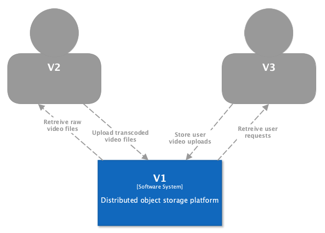

# Video upload and storage

**Team Members:** [Azriel Bachrach](mailto:asbachr1@mail.yu.edu), [Yaakov Baker](mailto:ybaker@mail.yu.edu), [Max Friedman](mailto:mfriedm8@mail.yu.edu)

## Project Plan

- [Scope and Use Cases](scope.md)
- [Distributed System Challenges](challenges.md)
- [Workflow Diagrams (BPMN)](workflow.md)
- [Software Architecture Diagrams (C4)](architecture.md)
- [Tools & Technologies](technologies.md)
- [Installation Instructions](installation.md)
- [API Documentation](api.md)

## Overview

> _Provide a short introduction, summary and functional overview of what your project group is trying to achieve and implement. Give the context within the greater system and application._

The goal of our project is to implement a distributed object storage system (similar to <a href="https://aws.amazon.com/s3/">Amazon S3</a>). The system will allow for highly available, and efficient distributed storage and retrieval of objects.

This system will be used by the other 2 Video Streaming Platform groups: 

- Group V3 will use our platform to store the videos that are uploaded. They will also serve user's streaming requests by retrieving the requested video files from our system.

- Group V2 will retrieve the raw video uploads from our platform. They will apply different transformations to the video and then store the re-encoded videos on our platform.

*System context C4 diagram*
