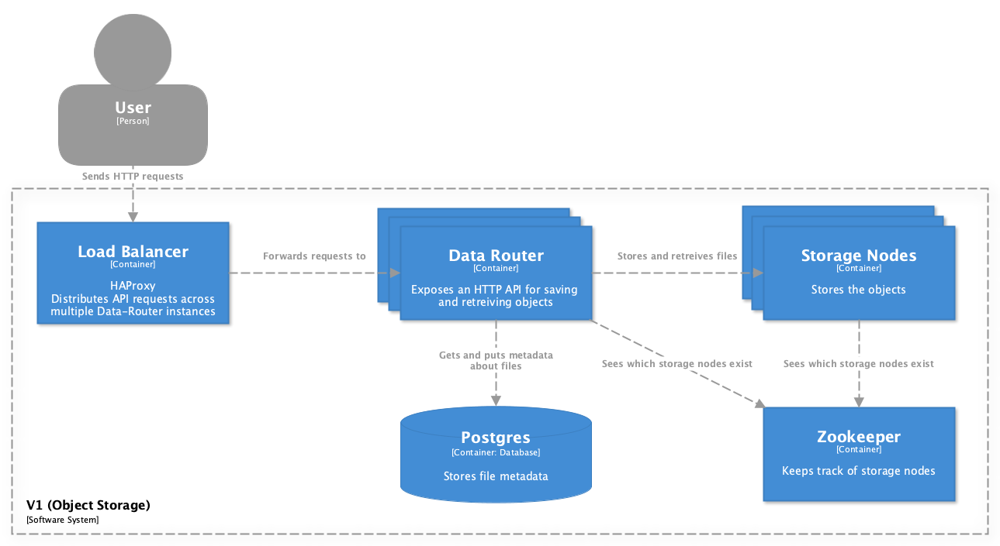

# Software Architecture Diagrams (C4)

> *Define your architecture using C4 diagrams to visualize the system. Be sure to indicate where and how redundancy is used in your system. Reference workflow and the distributed challenges documents where appropriate.*

## System Context diagram

## Container diagram

