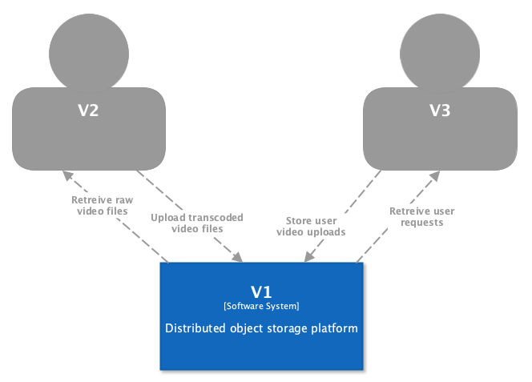

# Software Architecture Diagrams (C4)

> *Define your architecture using C4 diagrams to visualize the system. Be sure to indicate where and how redundancy is used in your system. Reference workflow and the distributed challenges documents where appropriate.*

## System Context diagram

## Container diagram

##### Load Balancer

The load balancer is used to distribute the load across multiple Data Router instances. We are using [HAProxy](https://www.haproxy.org) as a load balancer.

##### Data Router

The data router exposes an HTTP API for users to store and retrieve files. It then communicates with the Storage nodes to handle users requests. The data router is built from scratch using Java and spring boot.

We have multiple instances of the data router in order to handle many concurrent users and to continue working if any data routers fail. We can increase or decrease the number (*scale*) of data routers to meet demand.

##### Storage Nodes

The storage nodes store the files and replicate the data amongst themselves. The data router is built from scratch using Java.

We have multiple storage nodes in our system and can add or remove nodes as needed. having multiple storage nodes allows our system to have more storage and bandwidth than a single node can have on its own. It also protects our data and keeps the system available in the face of node failure due to replication.

##### Zookeeper

We use [Apache Zookeeper](https://zookeeper.apache.org) to manage the storage nodes and keep track of their health status. It is used by the storage nodes to know where files can be replicated files and when to re-replicate. It is used by the Data Router to know where files are able to be stored and where to retrieve them.

##### Postgres

We use a [Postgres](https://www.postgresql.org) database to store metadata about the files stored in the system. It is used by the Data Routers to keep track of the files that have been stored on the system.
