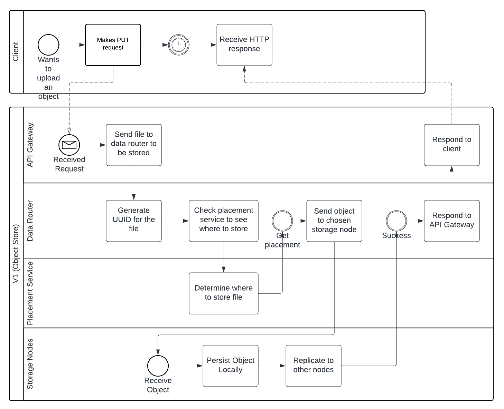
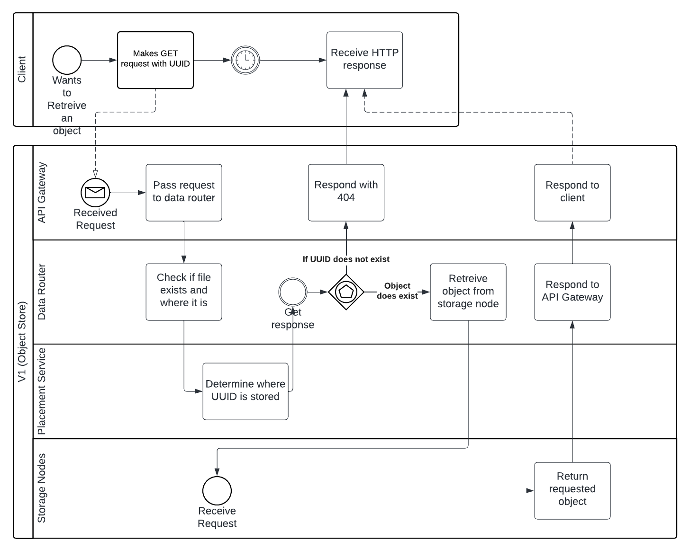

# Workflow Diagrams (BPMN)

*Display workflow diagrams for each of your supported use cases. Link to the scope and architecture documents where appropriate.*

The Data Router node and its logic are split into its three main jobs here:
1. API Gateway (Endpoint)
2. Data Routing
3. Placement Service

### Uploading a file

This BPMN diagram outlines the steps that occur when uploading an object

### Retrieving a file

This BPMN diagram outlines the steps that occur when retrieving an object

DATA STORE:

